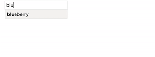

# react-enty-input
Extremely simple react component, in which user can add entries from given immutable set. Provides suggestions as user types.


## Installation
```
npm install --save react-redux-entry-input
```
## Usage
```javascript
import React from 'react';
import {connect} from 'react-redux';

import EntryInput from 'react-redux-entry-input';

import {
  addEntry,
  removeEntry,
} from './actions.js';

const mapStateToProps = state => {
  const entries = state.get('entries');
  const colors = state.get('colors');
  return {
    entries,
    colors
  };
};

export class Example extends React.Component {
  constructor(props) {
    super(props);
  }
  render() {
    return (
      <EntryInput
          actionAddEntryToState={this.props.addEntry}
          actionRemoveEntryFromState={this.props.removeEntry}
          entries={this.props.entries}
          minQueryLength={2}
          suggestions={this.props.colors}
      />
    );
  }
}

export const ExampleContainer = connect(
  mapStateToProps, {
    addEntry,
    removeEntry
  }
)(Example);
```
## Props
###EntryInput
#####actionAddEntryToState: React.PropTypes.func.isRequired
Action which is used to add values to store when user adds new entries to input from suggestions.
#####actionRemoveEntryFromState: React.PropTypes.func.isRequired
Action which is used to remove values from store when user decides to remove entries.
#####entries: React.PropTypes.object.isRequired
Variable, which contains entries added by user
**Requires immutable type**
#####minQueryLength: React.PropTypes.number
Mininum amount of characters typed to display suggestions
*defaults to 1*
#####nameVariable: React.PropTypes.string
*defaults to 'name'*
#####newTagOn: React.PropTypes.array
Pressing these keys will trigger actionAddEntryToState
*defaults to \[13, 9\] (enter and tab key)*
#####placeholder: React.PropTypes.string
placeholder on the input field
*defaults to entries*
#####suggestions: React.PropTypes.object.isRequired
Only these values can be entered to input field by the user
## Other
* Suggestions and/or Entries component can be used separately (e.g. to list entries somewhere else)
* See [demo-style.css](https://github.com/tohalla/react-enty-input/blob/master/demo-style.css) for example on styling the component
